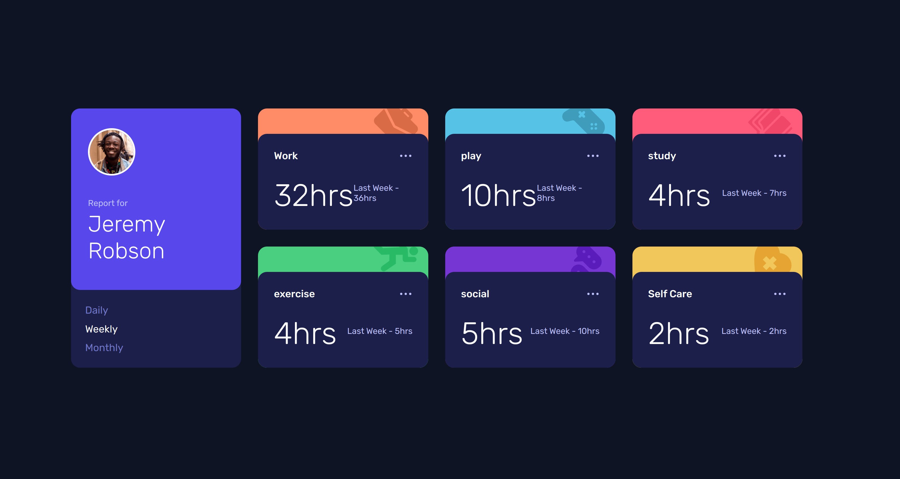

<!-- PROJECT LOGO -->

<h3 align="center">Time-tracking-dashboard</h3>

  <p align="center">
    Time tracking dashboard | Responsive
    <br />
    <br />
    <a href="https://incandescent-truffle-2444d9.netlify.app/">View Demo</a>
    ·
    <a href="https://github.com/shpokas270/time-tracking-dashboard/issues">Report Bug</a>
    ·
    <a href="https://github.com/shpokas270/time-tracking-dashboard/pulls">Request Feature</a>
  </p>
</div>

<!-- TABLE OF CONTENTS -->
<details>
  <summary>Table of Contents</summary>
  <ol>
    <li>
      <a href="#about-the-project">About The Project</a>
      <ul>
        <li><a href="#built-with">Built With</a></li>
      </ul>
    </li>
    <li>
      <a href="#what-was-learned">What was learned</a>
    </li>
    <li>
      <a href="#installation">Installation</a>
    </li>
    </li>
    <li><a href="#contact">Contact</a></li>
    <li>
      <a href="#left-to-do">Left to do</a>
    </li>
  </ol>
</details>

<!-- ABOUT THE PROJECT -->

## About The Project

Welcome to time-tracking-dashboard project it contains:

- Responsive design for Dekstop|Tabled|Mobile
- Different hover effects
- Data of time from JSON, imitation of local API
- Switch between viewing Daily, Weekly, and Monthly stats



<p align="right">(<a href="#readme-top">back to top</a>)</p>

### What was learned

- First use case of SASS (freaking love it so much)
- Deepening foundational knowledge of API fetch method
- Getting used to using media queries and building mobile first

### Built With

- ![JavaScript][JavaScript]
- ![NPM][NPM]
- ![SASS][SASS]
- ![HTML5][HTML5]
- ![CSS3][CSS3]

<p align="right">(<a href="#readme-top">back to top</a>)</p>

<!-- GETTING STARTED -->

### Installation

1. Clone the repo
   ```shh
   git clone git@github.com:shpokas270/time-tracking-dashboard.git
   ```
2. Open package.json and type:

   ```
   npm install
   ```

<p align="right">(<a href="#readme-top">back to top</a>)</p>

<!-- LEFT TO DO -->

### Left to do

<ul>
<li>Fix bug, my data.json file reads like a html file</li>
<li>After above fixed, finish javaScript logic</li>
</ul>

<!-- CONTACT -->

## Contact

Skirmantas Spakovskis - [@LinkedIn](https://www.linkedin.com/in/skirmantasspakovskis/) - skirm.spak@gmail.com

Project Link: (https://github.com/shpokas270/time-tracking-dashboard)

<p align="right">(<a href="#readme-top">back to top</a>)</p>

<!-- MARKDOWN LINKS & IMAGES -->
<!-- https://www.markdownguide.org/basic-syntax/#reference-style-links. -->

[NPM]: https://img.shields.io/badge/NPM-%23000000.svg?style=for-the-badge&logo=npm&logoColor=white
[Webpack]: https://img.shields.io/badge/webpack-%238DD6F9.svg?style=for-the-badge&logo=webpack&logoColor=black
[Vite]: https://img.shields.io/badge/Vite-B73BFE?style=for-the-badge&logo=vite&logoColor=FFD62E
[JavaScript]: https://img.shields.io/badge/javascript-%23323330.svg?style=for-the-badge&logo=javascript&logoColor=%23F7DF1E
[HTML5]: https://img.shields.io/badge/html5-%23E34F26.svg?style=for-the-badge&logo=html5&logoColor=white
[CSS3]: https://img.shields.io/badge/css3-%231572B6.svg?style=for-the-badge&logo=css3&logoColor=white
[SASS]: https://img.shields.io/badge/SASS-%23CC6699.svg?style=for-the-badge&logo=sass&logoColor=white
[product-screenshot]: public/images/prev.png
